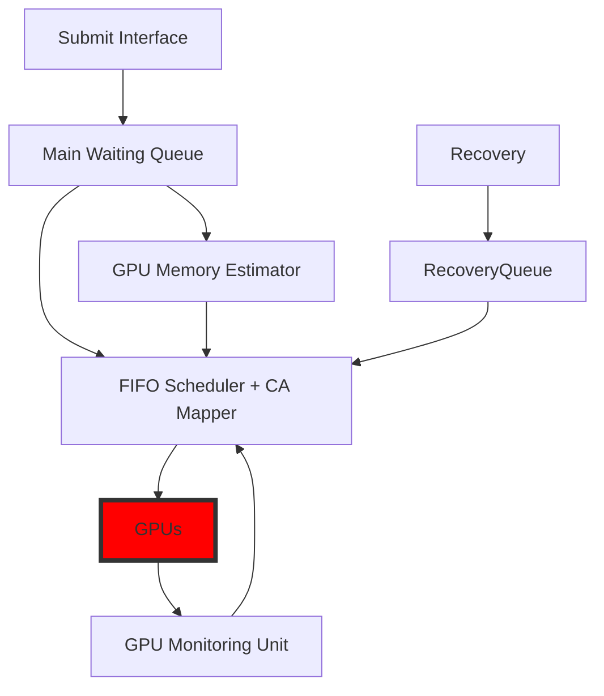

# CARMA: Collocation-Aware Resource Manager with GPU Memory Estimator

CARMA is a server‑scale task scheduler/mapper that boosts GPU utilization via safe task‑level collocation guided by a lightweight GPU memory estimator (GPUMemNet) and guarded by utilization/memory preconditions and a crash‑recovery loop.

<p align="center">

</p>


## CARMA architecture

Note that, **CA Mapper** stands for **C**ollocation-**A**ware **Mapper**



## Evaluation Workloads

For evaluating the idea of CARMA, we used a subset of the Philly trace to mimic realistic task-arrival behavior in a real-world system. We built two derived traces, one with [90 tasks](assets/philly-based-evaluation-traces/philly_mix-90-tasks.sh) and another with [60 tasks](assets/philly-based-evaluation-traces/philly_heavy-60-tasks.sh). Because the Philly trace does not specify the actual jobs, we assembled light, medium, and heavy training tasks—including both CNNs and Transformers—guided by recent findings on production cluster loads. In the 90-task trace, we included a full mix of light, medium, and heavy jobs with varied runtimes to reflect a realistic scenario; in the 60-task trace, we focused on medium and heavy jobs. The chosen workloads are:

### Transformer (WikiText-2) — *heavy*

| Model           | BS | GPUs | ET (m) | Epochs | Mem (GB) |
|:----------------|---:|----:|------:|------:|---------:|
| `xlnet_base`    |  8 |   2 |  8.95 |     8 |     9.72 |
| `BERT_base`     | 32 |   1 | 14.87 |     1 |    20.77 |
| `xlnet_large`   |  4 |   2 | 25.31 |     3 |    14.55 |
| `BERT_large`    |  8 |   1 | 44.93 |     1 |    13.57 |
| `gpt2_large`    |  8 |   2 | 64.96 |     1 |    27.90 |


### CNN (ImageNet) — *medium / heavy*

| Model             | BS | GPUs | ET (m) | Epochs | Mem (GB) |
|:------------------|---:|----:|------:|------:|---------:|
| `efficientnet_b0` |  32 |   1 | 36.21 |     1 |     4.96 |
| `efficientnet_b0` |  64 |   1 | 35.41 |     1 |     7.84 |
| `efficientnet_b0` | 128 |   1 | 35.21 |     1 |    13.83 |
| `resnet50`        |  32 |   1 | 36.32 |     1 |     5.26 |
| `resnet50`        |  64 |   1 | 35.50 |     1 |     8.54 |
| `resnet50`        | 128 |   1 | 35.01 |     1 |    15.12 |
| `mobilenet_v2`    |  32 |   1 | 36.09 |     1 |     4.54 |
| `mobilenet_v2`    |  64 |   1 | 35.43 |     1 |     7.22 |
| `mobilenet_v2`    | 128 |   1 | 34.91 |     1 |    12.58 |
| `vgg16`           |  32 |   1 | 48.45 |     1 |     8.22 |
| `vgg16`           |  64 |   1 | 44.38 |     1 |    13.64 |
| `vgg16`           | 128 |   1 | 42.42 |     1 |    24.41 |
| `Xception`        |  32 |   1 | 46.86 |     1 |     7.20 |
| `Xception`        |  64 |   1 | 45.78 |     1 |    11.52 |
| `Xception`        | 128 |   1 | 44.44 |     1 |    22.98 |
| `inception`       |  32 |   1 | 50.10 |     1 |     6.35 |
| `inception`       |  64 |   1 | 46.29 |     1 |    10.56 |
| `inception`       | 128 |   1 | 44.85 |     1 |    19.02 |


### CNN (CIFAR-100) — *light*

| Model             | BS | GPUs | ET (m) | Epochs | Mem (GB) |
|:------------------|---:|----:|------:|:------:|---------:|
| `efficientnet_b0` |  32 |   1 | 0.77 | 20,50 |     1.86 |
| `efficientnet_b0` |  64 |   1 | 0.48 | 20,50 |     1.91 |
| `efficientnet_b0` | 128 |   1 | 0.27 | 20,50 |     2.05 |
| `resnet18`        |  32 |   1 | 0.33 | 20,50 |     1.96 |
| `resnet18`        |  64 |   1 | 0.22 | 20,50 |     1.97 |
| `resnet18`        | 128 |   1 | 0.16 | 20,50 |     2.01 |
| `resnet34`        |  32 |   1 | 0.49 | 20,50 |     2.15 |
| `resnet34`        |  64 |   1 | 0.30 | 20,50 |     2.17 |
| `resnet34`        | 128 |   1 | 0.20 | 20,50 |     2.19 |
| `S_mobilenetv3`   |  32 |   1 | 0.54 | 20,50 |     1.78 |
| `S_mobilenetv3`   |  64 |   1 | 0.32 | 20,50 |     1.79 |
| `S_mobilenetv3`   | 128 |   1 | 0.22 | 20,50 |     1.82 |


### Related tool: Philly Trace Analyzer & Task Mapper

For reproducibility, we provide a companion repository that analyzes the Philly trace and generates evaluation traces. It can:
- Extract a **configurable time window** from the Philly trace  
- Extract **waiting time** before each task submission and the **number of tasks** submitted 
- **Map** trace arrivals to specified jobs  
- **Simulate** a baseline on a **DGX Station A100** where each job gets GPUs **exclusively**. Note that the time of the tasks needs to be specified as it is a simulation.

👉👉👉 [Philly-Trace-Analyser-and-Task-Mapper](https://github.com/ehsanyousefzadehasl/Philly-Trace-Analyser-and-Task-Mapper)


## Further improvements TODOs

1. Making atomic time slots [yet their size to be configurable | e.g., 12h] for each mapped for execution. It brings fairness into the system and avoid head-of-line blocking.

2. Making recovery method more flexible

3. Keeping track of mapped tasks in an efficient data structure to not only rely on monitoring GPUs (It can facilitate decision making process in cases of exclusive assignment, and make recovery method more efficient in terms of checking less error files instead of all of the files in a directory)

## License & Citation
```bibtex
@article{yousefzadeh2025carma,
  title={CARMA: Collocation-Aware Resource Manager with GPU Memory Estimator},
  author={Yousefzadeh-Asl-Miandoab, Ehsan and Karimzadeh, Reza and Ibragimov, Bulat and Ciorba, Florina M and Tozun, Pinar},
  journal={arXiv preprint arXiv:2508.19073},
  year={2025}
}
```